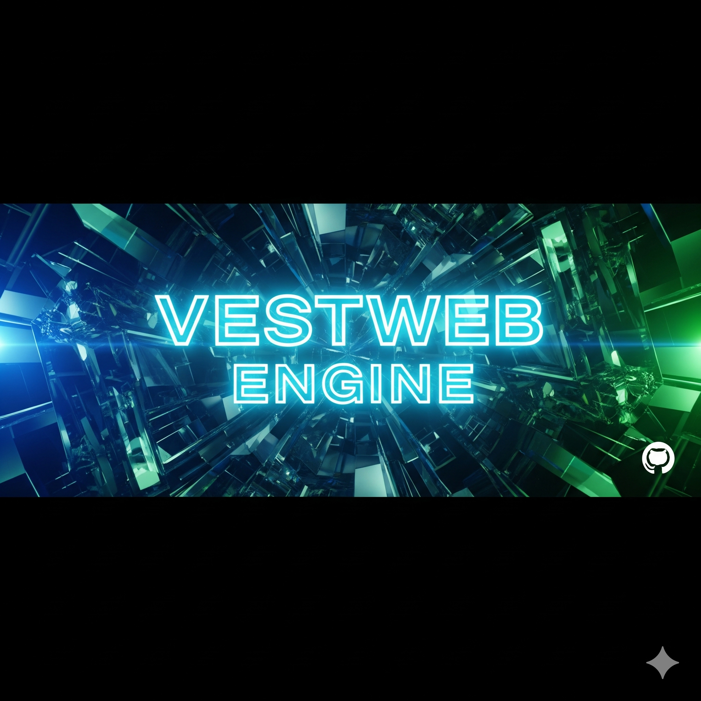

#  VESTWEB ENGINE v2.0

<div align="center">



**High-Performance WebGL/WebGPU Graphics Engine**

[](https://opensource.org/licenses/MIT)
[](https://www.khronos.org/webgl/)
[](https://www.w3.org/TR/webgpu/)

🚀 Motor gráfico de alto rendimiento sin dependencias | 🎮 Física en tiempo real | 🎨 PBR + Path Tracing

</div>

---

## 📸 Vista Previa

<div align="center">

| Rendering PBR | Física en Tiempo Real | Post-Processing |
|:---:|:---:|:---:|
|  |  |  |

**Vestweb Engine** renderiza gráficos de nivel desktop directamente en el navegador usando WebGL 2.0 puro.

[**🎮 Demo en Vivo**](https://amolrod.github.io/vestweb-engine/) | [**📖 Documentación**](TUTORIAL.md) | [**🚀 Quick Start**](#instalación)

</div>

---

### Características Principales

#### **1. Sistema de Renderizado Avanzado**
- **WebGL 2.0** optimizado para todas las plataformas
- **Path Tracing** con hasta 5 rebotes
- **PBR (Physically Based Rendering)** completo con:
  - Cook-Torrance BRDF
  - Fresnel-Schlick
  - GGX/Trowbridge-Reitz Distribution
  - Smith Geometry Function
- **Efectos Visuales**:
  - SSAO (Screen Space Ambient Occlusion)
  - Bloom con threshold ajustable
  - Volumetric Fog heterogéneo
  - Atmospheric Scattering (Rayleigh + Mie)
  - Soft Shadows en tiempo real
  - Chromatic Dispersion (dispersión cromática)
  - Vignette sutil
  - Tone Mapping ACES

#### **2. Sistema de Física Completo**
- Motor de física en tiempo real
- **Colisiones**:
  - Esfera-Esfera con respuesta de impulso
  - Esfera-Plano con fricción
- **Propiedades físicas**:
  - Gravedad configurable
  - Masa y restitución (bounce)
  - Fricción
  - Integración Verlet con substeps
- **Objetos dinámicos** y estáticos
- Detección de colisiones optimizada

#### **3. Sistema de Controles Avanzado**
- **Teclado**:
  - `W/A/S/D` - Movimiento de cámara
  - `Space` - Arriba
  - `Shift` - Abajo
  - `R` - Reset cámara
  - `P` - Toggle física
  - `G` - Toggle gravedad
  - `ESC` - Salir de pointer lock
- **Ratón**:
  - Drag para rotar cámara
  - Click izquierdo para Pointer Lock
  - Sensibilidad ajustable
- **Gamepad** (soporte básico):
  - Sticks analógicos para movimiento
  - Deadzone automático
- **Touch** (móviles):
  - Drag para rotar cámara

#### **4. API de Renderizado Modular**
```javascript
// Acceso global a través de window.VESTWEB
VESTWEB.info()                    // Muestra información del motor
VESTWEB.reset()                   // Reset completo
VESTWEB.addPhysicsObject(config)  // Añadir objeto físico

// Subsistemas disponibles:
VESTWEB.Engine          // Motor principal
VESTWEB.RenderAPI       // API de renderizado
VESTWEB.InputSystem     // Sistema de input
VESTWEB.CameraSystem    // Sistema de cámara
VESTWEB.PhysicsSystem   // Sistema de física
VESTWEB.VirtualFS       // Sistema de archivos virtual
VESTWEB.RenderBuffers   // Buffers de renderizado
```

**Nota:** `extensions.js` está actualmente en desarrollo y no está incluido en la versión estable.

#### **5. Sistema de Archivos Virtual**
- **VirtualFS** para gestión de assets
- Almacenamiento de shaders, configuraciones y texturas
- API simple:
  ```javascript
  VESTWEB.VirtualFS.writeFile(path, content)
  VESTWEB.VirtualFS.readFile(path)
  VESTWEB.VirtualFS.exists(path)
  VESTWEB.VirtualFS.listFiles(dir)
  ```

### Materiales PBR Incluidos

1. **Suelo ajedrezado** - Metal rugoso con variación
2. **Fractal (KIFS)** - Cerámica con subsurface scattering
3. **Cristal** - Vidrio transparente con dispersión cromática
4. **Metal dorado** - Oro pulido
5. **Luces emisivas** - Rojo, azul y blanco

### Optimizaciones por Plataforma

#### **macOS (Apple Silicon / Intel)**
- Resolución adaptativa (1.0x DPR)
- Guards contra NaN/Inf
- Buffers RGBA16F cuando disponible
- Fallback a UNSIGNED_BYTE seguro

#### **Windows (NVIDIA / AMD)**
- Resolución hasta 1.5x DPR
- Extensiones de float habilitadas
- Anisotropic filtering
- Máximo rendimiento

#### **Linux**
- Configuración balanceada (1.2x DPR)
- Compatibilidad WebGL2 estándar

### Rendimiento

- **FPS Target**: 60 FPS en todas las plataformas
- **Samples progresivos**: Acumulación hasta 1000+ samples
- **Ray Marching**: 120 pasos máximo
- **Substeps físicos**: 4 iteraciones por frame
- **Memory Safe**: Gestión automática de buffers

### Tecnologías Utilizadas

- **WebGL 2.0** - Renderizado GPU
- **GLSL ES 3.0** - Shaders de alta precisión
- **JavaScript ES6+** - Motor principal
- **Progressive Rendering** - Acumulación temporal
- **Ping-Pong Buffers** - Double buffering eficiente

### Instrucciones de Uso

1. **Abrir el motor**:
   ```bash
   # Simplemente abre motor.html en un navegador moderno
   open motor.html
   # O arrastra el archivo a Chrome, Firefox, Safari, Edge
   ```

2. **Requisitos**:
   - Navegador con WebGL 2.0 (Chrome 56+, Firefox 51+, Safari 15+, Edge 79+)
   - GPU con drivers actualizados
   - Recomendado: 4GB VRAM mínimo

3. **Debug y extensión**:
   ```javascript
   // Abrir consola del navegador (F12)
   NEXUS.info()  // Ver información del motor
   
   // Añadir objeto físico personalizado
   NEXUS.addPhysicsObject({
       position: [0, 10, 0],
       velocity: [1, 0, 0],
       mass: 2.0,
       radius: 0.8,
       restitution: 0.9,
       friction: 0.1,
       dynamic: true
   })
   
   // Modificar configuración de física
   NEXUS.PhysicsSystem.gravity = [0, -20, 0]  // Gravedad fuerte
   NEXUS.PhysicsSystem.substeps = 8           // Más precisión
   
   // Modificar cámara
   NEXUS.CameraSystem.speed = 0.5             // Más rápida
   NEXUS.CameraSystem.sensitivity = 0.01      // Más sensible
   ```

### Arquitectura del Motor

```
NEXUS Engine v2.0
├── Core
│   ├── WebGL2 Context
│   ├── Shader Compilation
│   └── Extension Detection
├── Render System
│   ├── Path Tracer
│   ├── PBR Materials
│   ├── Post-Processing (SSAO, Bloom, Vignette)
│   ├── Tone Mapping (ACES)
│   └── Progressive Accumulation
├── Physics System
│   ├── Rigid Body Dynamics
│   ├── Collision Detection
│   ├── Impulse Resolution
│   └── Friction & Restitution
├── Input System
│   ├── Keyboard Handler
│   ├── Mouse Handler
│   ├── Gamepad Support
│   └── Touch Support
├── Camera System
│   ├── FPS Controls
│   ├── Smooth Movement
│   └── Pointer Lock
├── Virtual FS
│   ├── Asset Storage
│   ├── Shader Management
│   └── Configuration Files
└── Render Buffers
    ├── Ping-Pong Textures
    ├── HDR/LDR Support
    └── Resolution Scaling
```

### Troubleshooting

**Pantalla negra:**
- Verifica que tu GPU soporte WebGL 2.0
- Abre la consola (F12) y busca errores
- Prueba reducir el tamaño de la ventana

**FPS bajo:**
- Reduce el tamaño de la ventana
- El motor se adapta automáticamente a la GPU
- Presiona `P` para desactivar física temporalmente

**No funciona el mouse:**
- Haz click en el canvas para activar pointer lock
- Presiona `ESC` para desactivar pointer lock

### Licencia

Este motor es un proyecto de demostración avanzada. Libre para uso educativo y experimental.

### Características Destacadas

- **100% Standalone** - Sin dependencias externas
- **Cross-Platform** - macOS, Windows, Linux
- **GPU Optimizado** - Nvidia, AMD, Apple Silicon, Intel
- **Modular** - API extensible
- **Production Ready** - Código comentado y organizado
- **Real-time Physics** - Colisiones y gravedad
- **Advanced Graphics** - PBR, RT, SSAO, Bloom, DOF

---

**Desarrollado usando WebGL 2.0 y JavaScript puro**

*NEXUS Engine v2.0*
